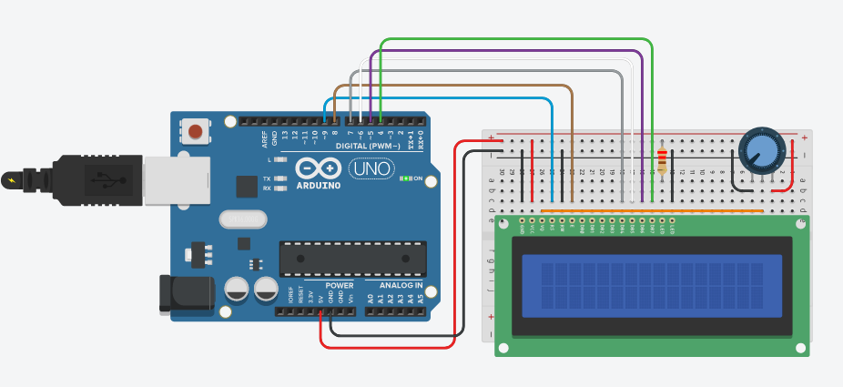

# **Home Office Status**

## **Purpose**

Notify home office status to avoid inopportune interruptions ex.: 

> Video Conf. [ON]

> Microfone [ON]

> [OFF]

## **Sending messages**

To send messages you need to put your message in this text file `./api/txt/msg.txt` between `<` `>`

## **Install**

Create a virtual env:

    python3 -m venv venv

Install requirements:

    pip install requeriments.txt

## Run

### API

> Change the IP in `./api/api.py` to your IP where `host='0.0.0.0'`

Activate virtual env:

    source venve/bin/activate

Run API:

    python api.py

### Hardware

> Change the `IPAddress server` for the machine running the API in `./hardware/home_office_status.ino`

**What you need:**
* Arduino uno
* Ethernet shield
* Potentiometer 10k
* Display LCD 16x2
* Resistor 220 ohms

**Circuit:**

